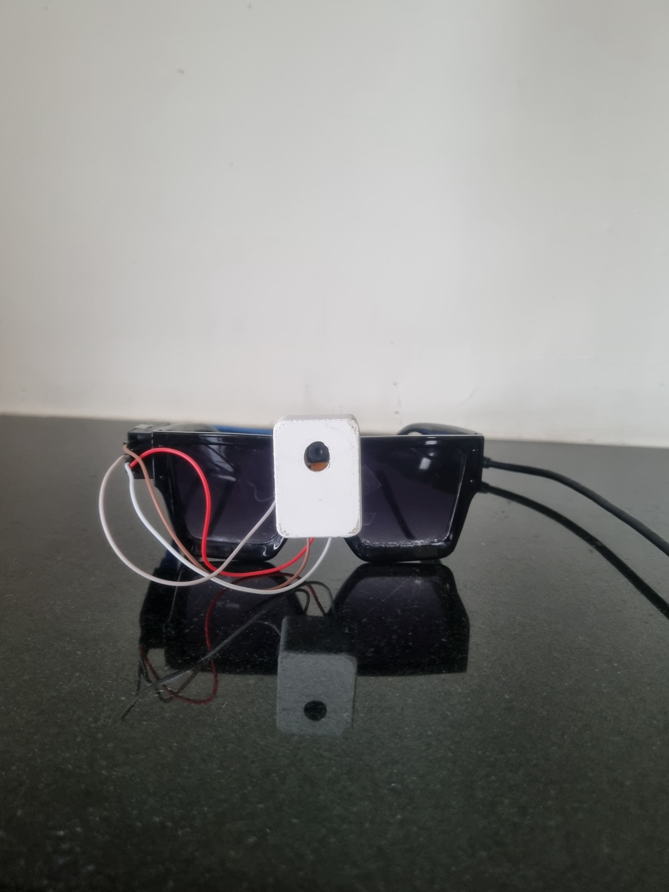
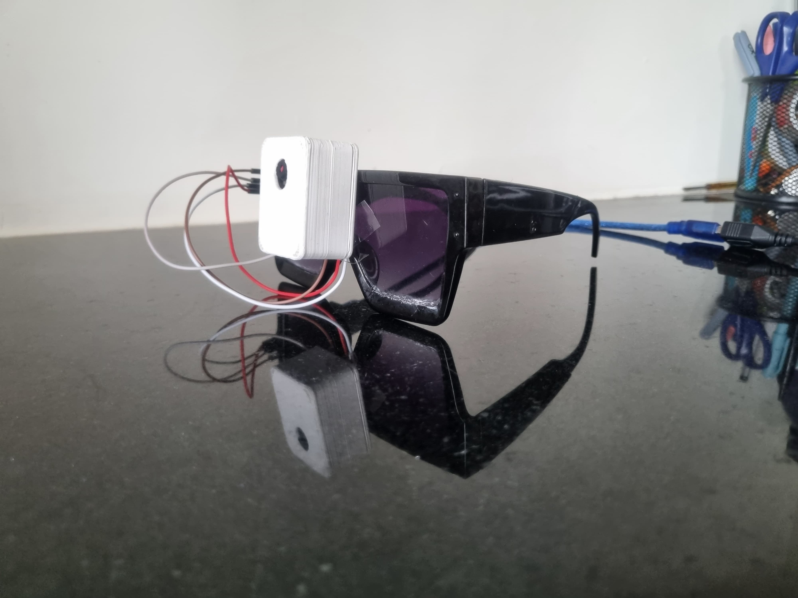
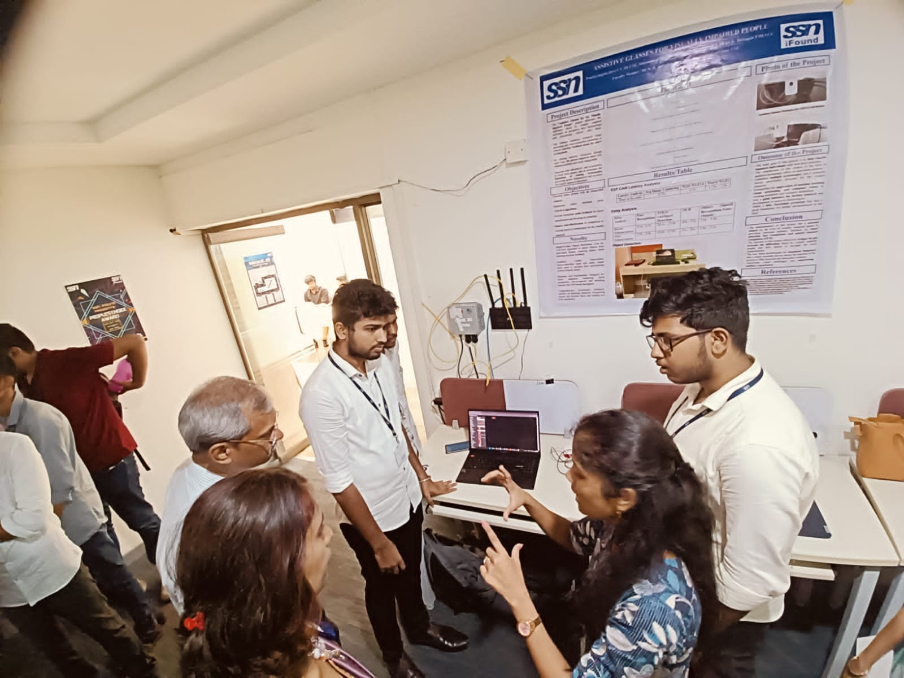
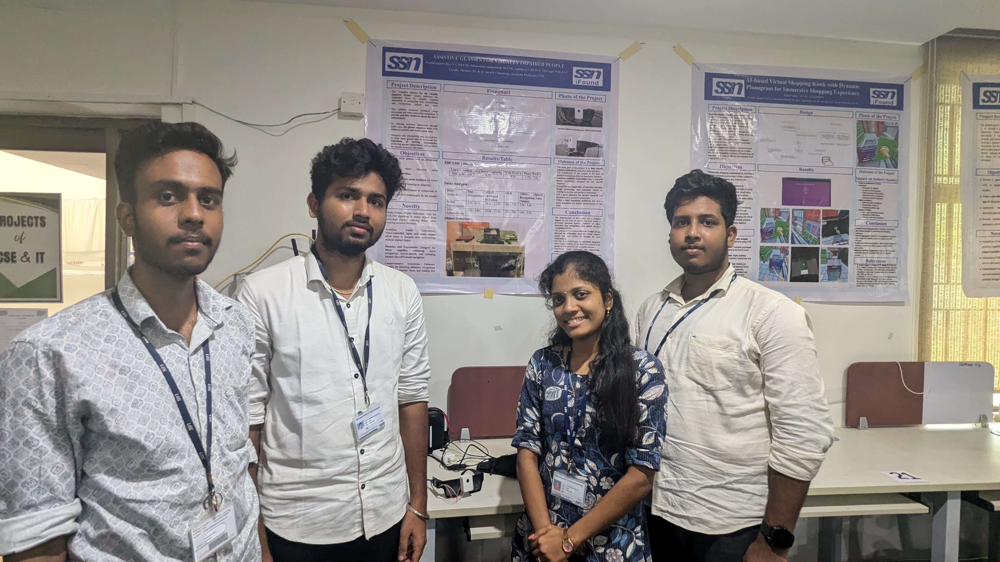
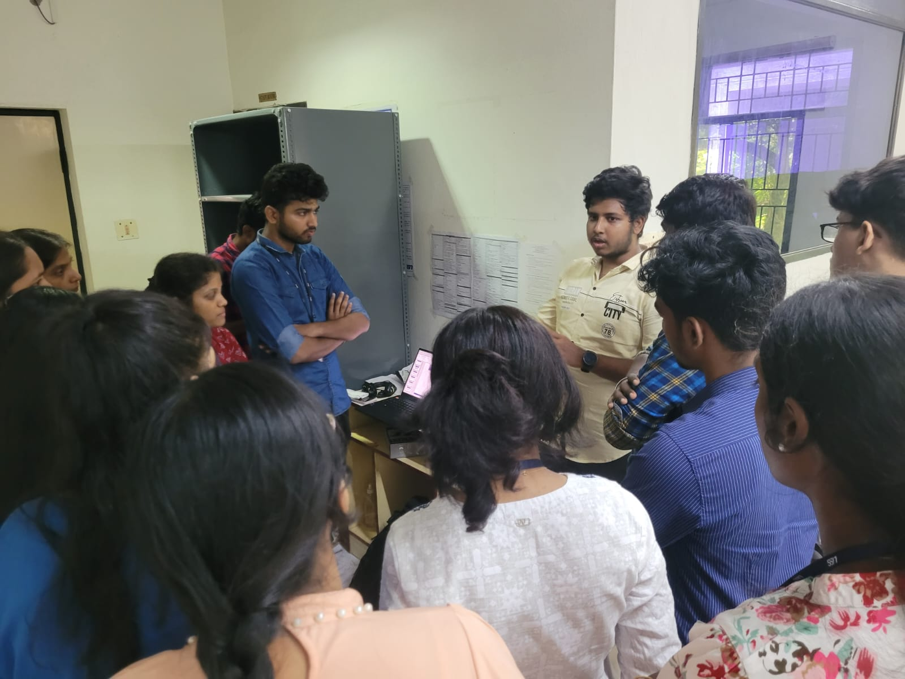

# Assistive Glasses for Visually Impaired People

 

> A lightweight, wearable assistive glasses system developed by third-year students at SSN College of Engineering under the IFSP program. Internally funded Student Project(₹25,000), completed in the 2024–25 academic cycle 

---

## 🌟 Overview

The **Assistive Glasses** project integrates object detection, face recognition, and OCR with real-time audio feedback to enhance mobility and independence for visually impaired users. Leveraging ESP32-CAM, Raspberry Pi 4B, and Python libraries (YOLOv4, face_recognition, EasyOCR, pyttsx3), this system provides:

- **Obstacle & Object Detection**: Alerts users to nearby objects.
- **Face Recognition**: Identifies known individuals.
- **Text Reading**: Reads signs and printed text aloud.
- **Voice Control**: Hands-free operation via speech commands.

## 📷 Prototype Images

<div align="center">
  
  <p><em>Front view of the assistive glasses prototype</em></p>
  
  
  <p><em>Side view showing the ESP32-CAM mounting and cable management</em></p>
</div>

## 🏆 Project Milestones

<div align="center">
  
  <p><em></em></p>
  
  
  <p><em>Innovation Day at SSN College</em></p>
  
  
  <p><em>Junior Interaction at IOT Workshop</em></p>
</div>

## 📂 Repository Structure
```bash
Assistive-Glasses-For-Visually-Impaired-People
│
├── main.py                       
├── Object Detection/            
│   ├── object_detect.py         
│   └── Model/                   
│       ├── yolov4.cfg           
│       ├── coco.names           
│       └── yolov4.weights       
├── Face Recognition/            
│   ├── face_recognition.py      
│   ├── esp_face_capture.py      
│   └── Datasets/                
├── OCR/                         
│   └── esp_ocr.py               
└── README.md                    
```


---

## 🛠️ Technologies & Components

- **Hardware**:
  - ESP32-CAM module for image capture
  - Raspberry Pi 4B as processing unit
  - USB headphones with integrated microphone for audio I/O
  - FTDI UART board and power management components
- **Software**:
  - Python 3.8+
  - OpenCV, NumPy
  - YOLOv4 (with Alexey Bochkovskiy weights) for object detection
  - `face_recognition` library for face detection/recognition
  - EasyOCR for text extraction
  - SpeechRecognition & pyttsx3 for voice commands and TTS

---


## 🔍 Usage

- **Start in Default Mode**: Runs object detection continuously, announcing obstacles.
- **Switch to Face Mode**: Say “detect face” to enable face recognition.
- **Switch to Text Mode**: Say “read text” to activate OCR.
- **Exit**: Say “stop” or press `Ctrl+C`.

Refer to the docstrings at the top of each script for detailed command lists.

---

## 📋 Project Funding & Impact

- **Allocated Budget**: ₹25,000  
- **Utilized**: ₹22,776  
- **Duration**: 2022 to 2024 academic years 

This low-cost prototype demonstrates how affordable, integrated assistive devices can be built using open-source hardware and software, aiming to improve daily mobility and social interaction for the visually impaired.

---

## 🙏 Acknowledgements

- Dr. K. R. Sarath Chandran & Dr. T. Mirnalinee for supervision  
- IFSP program coordinators and SSN College of Engineering
- Fellow team members: Prathiyangira Devi V C, Adhithya V, Dhivagar P

---

## 📞 Contact

For questions or collaboration:  
**Email**: saisandeep2210495@ssn.edu.in  
**GitHub**: [Saisandeepsangeetham](https://github.com/Saisandeepsangeetham)

© 2025 SSN College of Engineering

